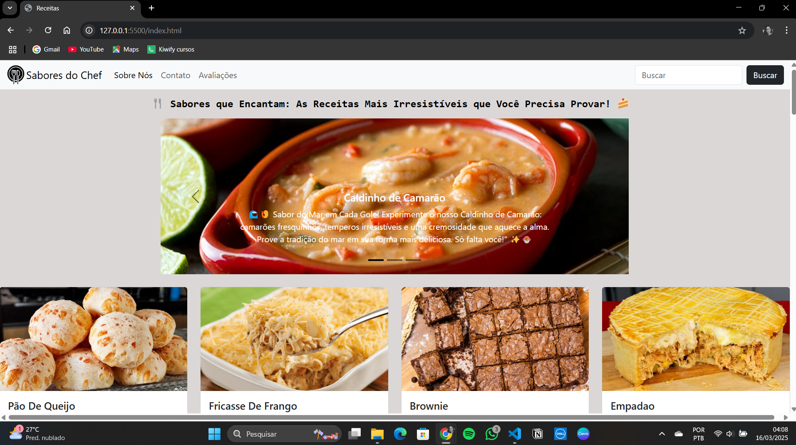

# 🍴 Sabores do Chef

Este repositório contém o código-fonte de um site de receitas simples, onde os usuários podem explorar pratos deliciosos, visualizar instruções passo a passo e filtrar receitas por categorias. O objetivo é oferecer uma experiência agradável e intuitiva para os amantes de culinária.

## 🌟 Sobre o Projeto

O site de receitas foi desenvolvido para ser leve, funcional e acessível. Ele permite que os usuários naveguem por diversas receitas, descubram instruções detalhadas e explorem conteúdos com um design limpo.

### Funcionalidades Principais:
- **Visualização de Receitas**: Exibe uma lista de receitas com imagens e descrições.
- **Detalhes das Receitas**: Mostra ingredientes e instruções detalhadas.
- **Design Responsivo**: Totalmente funcional em dispositivos móveis e desktops.

## 📚 Estrutura do Projeto

- **index.html**: Página principal com a lista de receitas.
- **style.css**: Estilos utilizados no site.
- **avalia.html**: Página relativa a avaliação.
- **script.js**: Contém as interações e funcionalidades do site.
- **SobreNos.html**: Página que contém informações sobre o site Sabores do Chef
- **chef.sgv**: Foto utilizada para o cursor.

## 🚀 Tecnologias Utilizadas

- **HTML**: Estruturação da página e conteúdo.
- **CSS**: Estilização dos componentes do site.
- **JavaScript**: Adiciona interatividade.

## 🤝 Contribuições
Sinta-se à vontade para contribuir com este repositório!  
💡 Sugira novas funcionalidades. 
🐛 Relate bugs ou problemas. 
📚 Compartilhe recursos ou melhorias no design. 

## 📬 Contato
Autor: Stephanie Caroline de Oliveira Macedo  
E-mail: stephaniecarolinedev@gmail.com  
LinkedIn: linkedin.com/in/stephanie-caroline-97973430b  
GitHub: https://github.com/StephanieCaroll  

